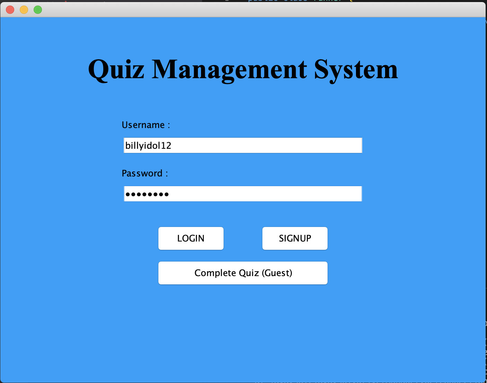

# Quiz Management System

A GUI-based quiz management application built with **Java Swing** and **MySQL**. Users can create quizzes with multiple-choice questions, share them via unique 5-character codes, and view quiz response analytics. Guest users can complete quizzes without creating an account.

---

## Features

- **User Authentication** — Register and log in with username/password (duplicate username prevention)
- **Change Password** — Update your password from the dashboard sidebar
- **Create Quizzes** — Add multiple-choice questions (4 options each) with a live question counter, and generate a guaranteed-unique 5-character quiz code
- **View & Manage Quizzes** — Browse your quizzes with response counts, view questions, see per-option vote totals, search by code, and delete quizzes with confirmation
- **Guest Access** — Anyone with a quiz code can take the quiz without an account
- **Response Analytics** — View how many respondents selected each option per question, plus total response count per quiz

---

## Screenshots

<p align="center"><strong>Login Screen</strong></p>
<p align="center"></p>

<p align="center"><strong>Create Quiz</strong></p>
<p align="center"></p>

<p align="center"><strong>View Quizzes</strong></p>
<p align="center"></p>

---

## Prerequisites

Before running this project, ensure you have the following installed:

| Requirement           | Version       | Download                                                                                             |
| --------------------- | ------------- | ---------------------------------------------------------------------------------------------------- |
| **Java JDK**          | 8 or higher   | [Oracle JDK](https://www.oracle.com/java/technologies/downloads/) or [OpenJDK](https://openjdk.org/) |
| **MySQL Server**      | 5.7 or higher | [MySQL Downloads](https://dev.mysql.com/downloads/mysql/)                                            |
| **MySQL Connector/J** | 8.x           | [Connector/J Download](https://dev.mysql.com/downloads/connector/j/)                                 |

### IDE (Optional)

- **VS Code** with the [Extension Pack for Java](https://marketplace.visualstudio.com/items?itemName=vscjava.vscode-java-pack) and [MySQL Shell Extension](https://marketplace.visualstudio.com/items?itemName=Oracle.mysql-shell-for-vs-code)
- **Eclipse** or **IntelliJ IDEA** (any Java IDE will work)

---

## Database Setup

### 1. Start MySQL Server

Make sure your MySQL server is running on `localhost:3306`.

### 2. Create the Database

```sql
CREATE DATABASE survey;
USE survey;
```

### 3. Create Required Tables

Run the following SQL statements to create all necessary tables:

```sql
CREATE TABLE actors (
    id INT PRIMARY KEY AUTO_INCREMENT,
    fname VARCHAR(50),
    uname VARCHAR(50),
    pass VARCHAR(50)
);

CREATE TABLE userQuestions (
    id INT,
    quizcode VARCHAR(5),
    total INT
);

CREATE TABLE questions (
    quizcode VARCHAR(5),
    question VARCHAR(255),
    option1 VARCHAR(255),
    option2 VARCHAR(255),
    option3 VARCHAR(255),
    option4 VARCHAR(255)
);

CREATE TABLE quizquestions (
    quizcode VARCHAR(5),
    qno INT,
    opno INT
);
```

### 4. Configure Database Credentials

Open `src/SQLoperations.java` and update the database connection constants to match your MySQL setup:

```java
private static final String DB_URL = "jdbc:mysql://localhost:3306/survey";
private static final String DB_USER = "root";
private static final String DB_PASS = "YOUR_PASSWORD_HERE"; // <-- Change this
```

---

## Project Structure

```
Quiz-System/
├── READMe.md
│
├── screenshots/                # Application screenshots
│   ├── Login.png
│   ├── Create Quiz.png
│   └── View Quizzes.png
└── src/
    ├── runner.java             # Entry point — launches the application
    ├── login.java              # Login screen UI and authentication
    ├── signup.java             # User registration screen
    ├── mainpage.java           # Main dashboard — create & view quizzes
    ├── guest.java              # Guest quiz-taking interface
    └── SQLoperations.java      # Database operations layer (PreparedStatements)
```

---

## How to Run

### Option A: Command Line

1. **Navigate to the project directory:**

   ```bash
   cd Quiz-System
   ```

2. **Compile all source files** (ensure the MySQL Connector JAR is in your classpath):

   ```bash
   javac -cp ".;path/to/mysql-connector-j-8.x.x.jar" src/*.java
   ```

   > On macOS/Linux, use `:` instead of `;` as the classpath separator.

3. **Run the application:**
   ```bash
   java -cp ".;src;path/to/mysql-connector-j-8.x.x.jar" runner
   ```

### Option B: VS Code

1. Open the `Quiz-System` folder in VS Code.
2. Install the **Extension Pack for Java** if not already installed.
3. Add the MySQL Connector JAR to the project's referenced libraries (Java Projects panel → Referenced Libraries → + button).
4. Open `src/runner.java` and click **Run** above the `main` method.

### Option C: Eclipse

1. Import the project as a Java project.
2. Right-click the project → **Build Path** → **Add External Archives** → select the MySQL Connector JAR.
3. Run `runner.java` as a Java Application.

---

## How It Works

### User Flow

1. **Launch** — The application starts at the **Login** screen.
2. **Sign Up** — New users click "SIGN UP", fill in their details, and create an account.
3. **Login** — Enter username and password to access the dashboard.
4. **Create a Quiz** — Click "ADD QUIZ" in the sidebar:
   - Enter a question and 4 options, then click "ADD QUESTION".
   - A counter displays how many questions have been added so far.
   - Repeat for as many questions as needed (up to 50).
   - Click "SUBMIT QUIZ" when done — a guaranteed-unique 5-character code is generated.
   - Share this code with anyone who should take the quiz.
5. **View Quizzes** — Click "VIEW QUIZZES" in the sidebar:
   - See all your quizzes listed by code with total response counts.
   - Click a quiz to browse its questions and see vote counts per option.
   - Use PREVIOUS/NEXT to navigate between questions.
   - Use DELETE to remove a quiz and all its responses (with confirmation).
   - Use the search bar to filter quizzes by code.
6. **Change Password** — Click "CHANGE PASSWORD" in the sidebar:
   - Enter your current password and new password (with confirmation).
   - Password is updated immediately after validation.
7. **Logout** — Click "LOGOUT" to return to the login screen.

### Guest Flow

1. On the Login screen, click "Complete Quiz as Guest".
2. Enter the 5-character quiz code provided by the quiz creator.
3. Answer each question by selecting a radio button and clicking "NEXT QUESTION".
4. After the last question, a completion message is shown and the response is recorded.

---

## Database Schema

| Table           | Purpose                                                                          |
| --------------- | -------------------------------------------------------------------------------- |
| `actors`        | Stores registered user accounts (id, name, username, password)                   |
| `userQuestions` | Maps users to their created quizzes and tracks total responses                   |
| `questions`     | Stores quiz questions and their 4 options, keyed by quiz code                    |
| `quizquestions` | Records individual guest responses (quiz code, question number, selected option) |

---

## Technologies Used

- **Java** — Core language
- **Java Swing** — GUI framework with system Look and Feel
- **MySQL** — Relational database
- **JDBC** — Java Database Connectivity with PreparedStatements (SQL injection safe)

---

## Security Features

- All database queries use **PreparedStatements** to prevent SQL injection
- Duplicate username registration is prevented at signup
- Quiz codes are verified for uniqueness before assignment
- Delete operations require user confirmation
- Null-safe input handling throughout the application

---

## License

This project is open source and available for educational purposes.
